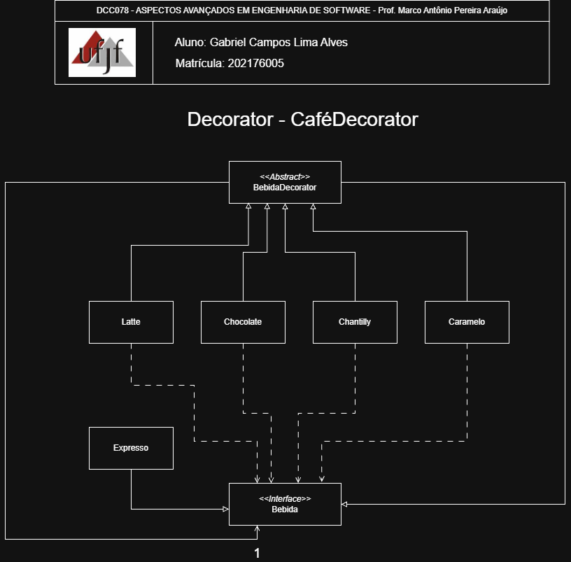

# Decorator — Sistema de Cafeteria

<p align="center">
  <a href="https://www.ufjf.br/" rel="noopener">
    
  </a>
</p>

<h3 align="center">DCC078-2025.3-A — Aspectos Avançados em Engenharia de Software (UFJF/ICE)</h3>

---

## 📝 Sumário
- [Sobre](#sobre)
- [Diagrama Nível de Projeto](#diagrama)
- [Funcionalidades](#funcionalidades)
- [Tecnologias](#tecnologias)
- [Exemplo de Uso](#exemplo)
- [Como Executar e Testes](#testes)
- [Autor](#autor)

## 🧐 Sobre <a name="sobre"></a>
> **Disciplina:** DCC078 – Aspectos Avançados em Engenharia de Software   </br>
> **Projeto:** Sistema de Cafeteria - Decorator   </br>
> **Docente:** Prof. Marco Antônio Pereira Araújo  </br>
> **Data de entrega:** 16/10/2025   </br>
> **Aluno:** [Gabriel Campos Lima Alves](#autor)  </br>

### Padrão Decorator
Implementação do padrão **Decorator** para adicionar responsabilidades a objetos de forma dinâmica no contexto de uma cafeteria.
O **Decorator** é um padrão estrutural que permite anexar novos comportamentos a objetos colocando-os dentro de objetos wrapper especiais, demonstrando:
- Adiciona funcionalidades (ingredientes) dinamicamente a uma bebida base
- Composição flexível ao invés de herança rígida
- Facilita adição de novos ingredientes sem modificar código existente
- Permite combinar múltiplos decoradores de forma livre

## 📐 Diagrama de Classe <a name="diagrama"></a>
O diagrama abaixo representa a arquitetura do projeto, destacando a aplicação do padrão **Decorator** no sistema de cafeteria:

<p align="center">
  
</p>

## 🚀 Funcionalidades <a name="funcionalidades"></a>
### Sistema de Cafeteria Implementado
- **Bebida**: Interface para componentes que podem ser decorados
- **Espresso**: Componente concreto representando a bebida base
- **BebidaDecorator**: Classe abstrata que mantém referência à bebida
- **Latte/Chocolate/Chantilly/Caramelo**: Decoradores concretos que adicionam ingredientes

### Recursos
- ✅ Adiciona ingredientes dinamicamente sem alterar a bebida base
- ✅ Composição flexível de múltiplos ingredientes
- ✅ Cálculo automático de preço baseado nos ingredientes adicionados
- ✅ Descrição dinâmica da bebida com todos os ingredientes
- ✅ Facilidade para adicionar novos ingredientes sem modificar código existente
- ✅ Evita explosão de subclasses para cada combinação possível

##  Tecnologias <a name="tecnologias"></a>
- **Java 11+**
- **JUnit 5** - Framework de testes
- **Maven** - Gerenciamento de dependências
- **Git** - Controle de versão

## 📊 Exemplo de Uso <a name="exemplo"></a>
```java
// Criando Espresso simples
Bebida espresso = new Espresso(5.00f);
System.out.println(espresso.getDescricao()); // "Espresso"
System.out.println(espresso.getPreco());      // 5.00

// Adicionando Latte ao Espresso (+30%)
Bebida latte = new Latte(new Espresso(5.00f));
System.out.println(latte.getDescricao());    // "Espresso + Latte"
System.out.println(latte.getPreco());         // 6.50

// Criando Mocha: Espresso + Chocolate + Latte
Bebida mocha = new Latte(new Chocolate(new Espresso(5.00f)));
System.out.println(mocha.getDescricao());    // "Espresso + Chocolate + Latte"
System.out.println(mocha.getPreco());         // 7.80

// Criando bebida especial com todos os ingredientes
Bebida especial = new Latte(
                    new Chocolate(
                        new Chantilly(
                            new Caramelo(
                                new Espresso(5.00f)))));
System.out.println(especial.getDescricao());
// Output: "Espresso + Caramelo + Chantilly + Chocolate + Latte"
System.out.println(especial.getPreco());
// Output: 9.87 (calculado dinamicamente)

// Facilidade para adicionar novos ingredientes
public void criarBebidaPersonalizada(Bebida base, List<BebidaDecorator> ingredientes) {
    Bebida bebida = base;
    for (BebidaDecorator ingrediente : ingredientes) {
        bebida = ingrediente.decorar(bebida);
    }
    // Qualquer combinação de ingredientes é possível
}
```

## 🧪 Como Executar e Testes <a name="testes"></a>
### Cobertura de Testes
- ✅ **Testes de Preço Base**: Validam o preço da bebida sem ingredientes
- ✅ **Testes de Ingredientes Individuais**: Verificam cálculo de preço para cada ingrediente
- ✅ **Testes de Descrição**: Confirmam geração correta da descrição da bebida
- ✅ **Testes de Múltiplos Decoradores**: Validam combinações de 2, 3 e 4 ingredientes
- ✅ **Testes do Padrão**: Confirmam separação entre componente e decoradores

### Pré-requisitos
- Java 11 ou superior
- Maven 3.6+

### Comandos
```bash
# Compilar o projeto
mvn clean compile

# Executar testes
mvn test

# Executar teste específico
mvn test -Dtest=BebidaTest#deveRetornarPrecoBebidaComTodosIngredientes

# Empacotar
mvn package
```

## 👨‍💻 Autor <a name="autor"></a>
**Gabriel Campos Lima Alves**  
Matrícula: 202176005  
Email: campos.gabriel@estudante.ufjf.br  
GitHub: [@CamposCodes](https://github.com/CamposCodes)

---

*Projeto de uso acadêmico exclusivo para a disciplina DCC078 - UFJF*
